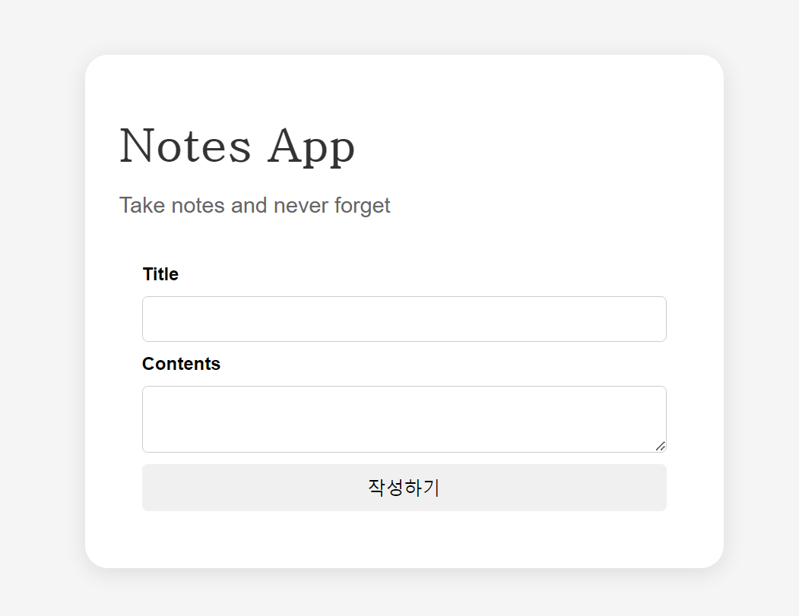

# React Note App Project
리액트 학습한 후 진행하는 노트앱 만들기입니다.

## 목표
- CRUD 기능 구현
- 페이지 새로고침을 해도 데이터가 남아있도록 구현
- 라우팅 적용 (react-router-dom)

## 화면
### HomePage

### CreatePage

### DetailPage

### EditPage

## 구현한 기능
- 노트 등록
- 노트 수정
- 노트 삭제
- Search 기능 (제목에 포함된 문자로 필터)
- 라우팅 적용(react-router-dom) 
- 로컬스토리지를 이용하여 데이터 저장

## 추가 구현할 기능
- ~~서버단 개발하여 api 통신~~
- Context API, Reducer를 이용하여 리펙토링
- 수정된 날짜로 필터링

## 수정해야할 사항
- 토큰이 만료된 상태일 때 토큰 재발급 로직 구현
- 통신 에러일 때 처리 로직 구현